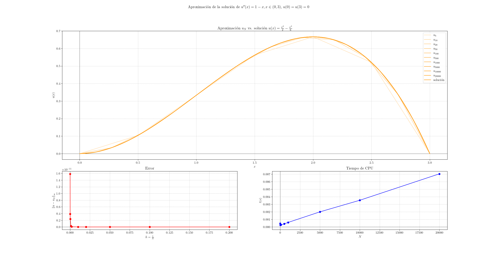

# Ejercicio 1 (edo_contorno_1.py)

Para instalar los requisitos necesarios para ejecutar el código, ejecutar el siguiente comando:

```bash
pip install -r requirements.txt
```

El archivo `Figure_1.png` es una imagen con el resultado esperado del código:



Se han añadido iteraciones superiores a 1000 para obtener una mejor estimación de la complejidad del algoritmo.